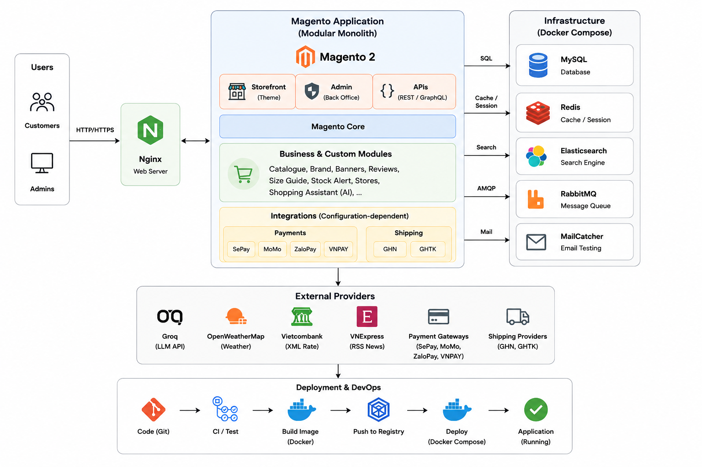
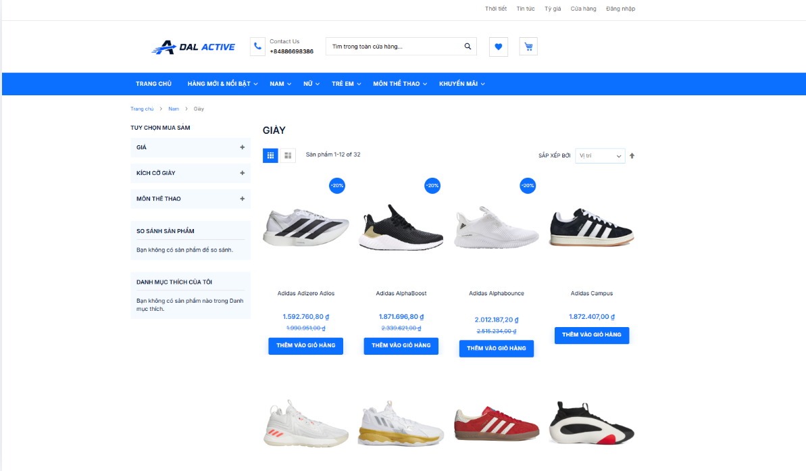
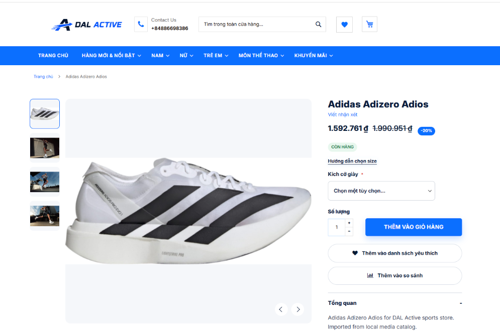
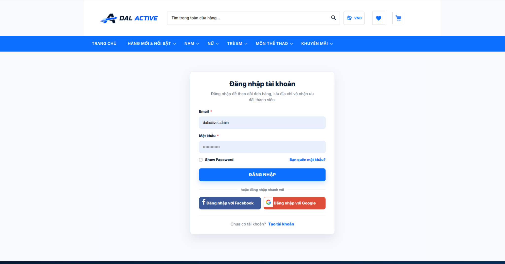
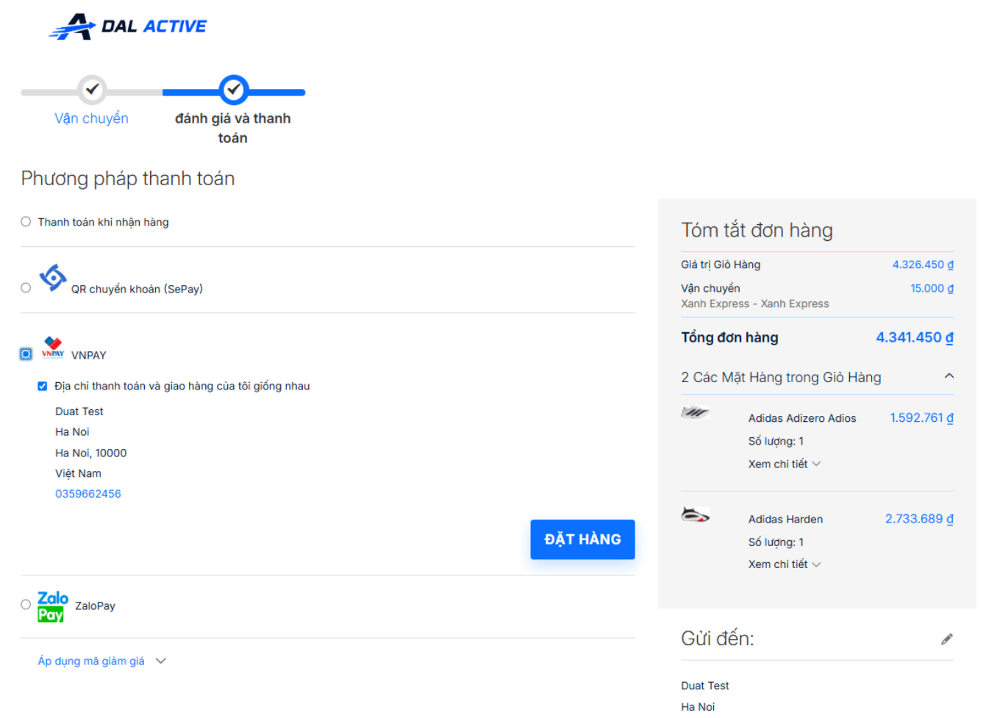
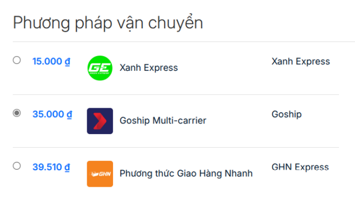
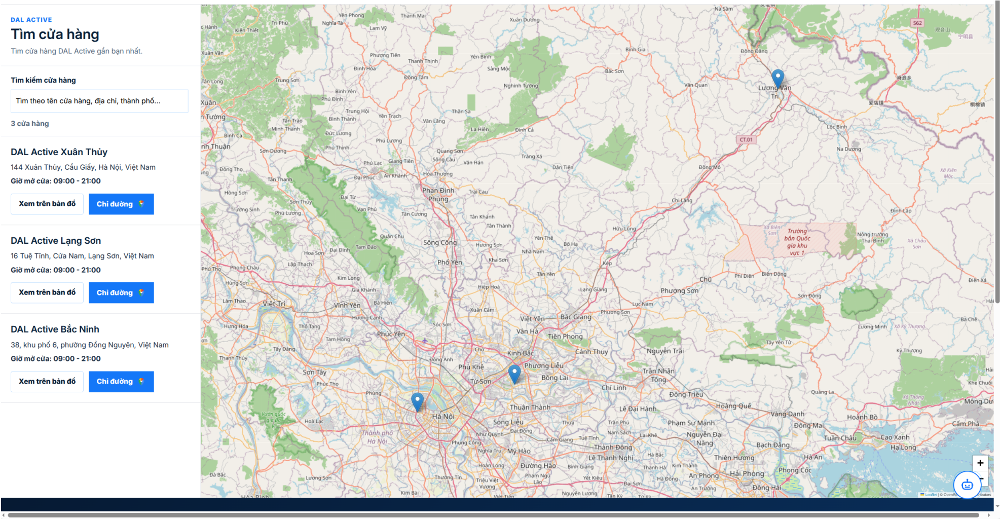
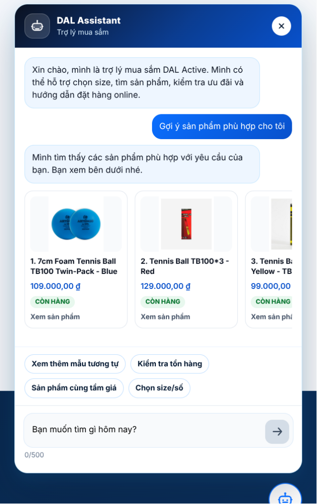

# DAL Active E-commerce

Nền tảng thương mại điện tử sản phẩm thể thao, xây dựng trên Magento Open Source 2.4.7 và bản địa hoá cho Việt Nam.

## Tổng quan

- Catalog sản phẩm thể thao, thương hiệu, size và sản phẩm biến thể.
- Storefront tiếng Việt, VND, hero banner, điều hướng tuỳ chỉnh và flash sale.
- Giỏ hàng, checkout, quản lý đơn hàng, đánh giá kèm ảnh, hướng dẫn chọn size và cảnh báo tồn kho.
- Thanh toán MoMo, VNPay, ZaloPay, SePay; vận chuyển GHN, GHTK; Store Locator.
- Trợ lý mua sắm, thời tiết, tỷ giá, tin thể thao và tin kinh tế.

## Công nghệ

- Magento Open Source 2.4.7, PHP 8.3 và Nginx.
- MySQL 8.0, Redis 7.2, Elasticsearch 7.17 và RabbitMQ 3.12.
- Docker Compose; Composer, JavaScript/LESS và Grunt cho phát triển theme.

Source Magento và các module tuỳ biến nằm trong `Sites/magento/src`; Docker Compose nằm tại `Sites/magento/compose.yaml`.



## Chạy local

Yêu cầu Docker Compose v2, Git, tối thiểu 8 GB RAM cho Docker và Magento Marketplace access keys.

```bash
git clone <repository-url>
cd dal-active-ecommerce/Sites/magento

cd env
for file in *.env.example; do cp "$file" "${file%.example}"; done
cd ..
```

Tạo `src/auth.json` bằng Magento Marketplace keys, sau đó khởi động stack:

```bash
make quick-start
./bin/copytocontainer --all
./bin/clinotty composer install
```

Nếu được cấp `backup-dalactive.sql`, khôi phục môi trường có dữ liệu:

```bash
./bin/mysql < backup-dalactive.sql
./bin/clinotty bin/magento setup:upgrade
./bin/setup-domain dalactive.test
./bin/bootstrap-current dalactive.test
./bin/clinotty bin/magento indexer:reindex
./bin/clinotty bin/magento cache:flush
```

Truy cập `https://dalactive.test`. Không commit API key, credential thanh toán, `auth.json` hoặc database dump.

## Giao diện tiêu biểu

<table>
  <tr>
    <td width="50%"></td>
    <td width="50%"></td>
  </tr>
  <tr>
    <td align="center"><sub>Danh mục sản phẩm</sub></td>
    <td align="center"><sub>Chi tiết sản phẩm</sub></td>
  </tr>
</table>

<table>
  <tr>
    <td width="50%"></td>
    <td width="50%"></td>
  </tr>
  <tr>
    <td align="center"><sub>Đăng nhập tài khoản</sub></td>
    <td align="center"><sub>Thanh toán và tóm tắt đơn hàng</sub></td>
  </tr>
</table>

<p align="center">
  
</p>
<p align="center"><sub>Các phương thức vận chuyển tại checkout</sub></p>

<table>
  <tr>
    <td width="60%"></td>
    <td width="40%"></td>
  </tr>
  <tr>
    <td align="center"><sub>Store Locator</sub></td>
    <td align="center"><sub>Shopping Assistant</sub></td>
  </tr>
</table>

## Lệnh thường dùng

```bash
make start                     # Bật container
make stop                      # Dừng stack
make restart                   # Khởi động lại stack
make status                    # Kiểm tra trạng thái
make log                       # Theo dõi log Magento
make verify-modules            # Kiểm tra module DAL Active
make setup-api-keys            # Cấu hình Weather, ExchangeRate, News
./bin/magento cache:flush
./bin/magento indexer:reindex
```

Sau khi sửa template, JavaScript hoặc LESS, chạy `scripts/sync-frontend-ui.sh`. Không sửa trực tiếp `pub/static` vì Magento tự sinh asset này.

## Tài liệu
- [Tài liệu và Slide](https://drive.google.com/drive/folders/1bO0qanbnRUoCAivxd0IKbeMvj9-Mw7tl)
